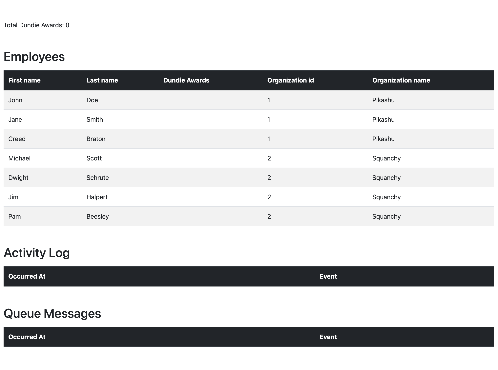

## Employee directory organization

This is an application for managing employees of a company. Employees belong to organizations within the company.

As recognition, employees can receive Dundie Awards.

* A `Dundie Award` is in reference to the TV show [The Office](https://en.wikipedia.org/wiki/The_Dundies) in which the main character hands out awards to his colleagues. For our purposes, it's a generic award.

## Instructions

In preparation for the upcoming call with NinjaOne, `clone` this repo and run it locally. If everything runs successfully, you will see the following page in your browser.

Become familiar with the application and it's characteristics. Use your favorite HTTP Client (like [Postman](https://www.postman.com/)) to exercise the endpoints and step through the code to help you get to know the application. 

In the call, we will introduce new code to the application, and you will comment on issues with the endpoint. Please be ready to share your screen in the call with us with the application ready to run. 

**Bonus:** Spot any issues or potential improvements you notice in the application while you're familiarizing yourself and make note of them for our call. We would love to see your input in how to make this application better.

## Changes

	- minor changes
		final variables
		security aspects
			defensive copying of mutable fields
		change entity id primitive types to boxed types
			jpa specification recommend use boxed types
				https://docs.jboss.org/hibernate/orm/5.3/userguide/html_single/Hibernate_User_Guide.html#entity-pojo-identifier
		delete call super() in constructors of entities, no its necessary
		replace expresions in functional style
		application.yml fix error hierarchical structure spring:spring and delete application.properties file
		refactory update awardcache total 

	- features:
		use dtos
		use object mappers - MapStructs
		create service layer
		refactoring controller to user service layer
		put @transactional in service 	
		api version /api/v1/ 			
		api return appropiates html codes and responses 
			return header location in create post 		
		global error control
			validate organization if exist when update an employeee
		api documentation OpenAPI 3 - Swagger UI
			/openapi
			/swagger-ui/index.html
		Spring MVC test support - Integration test
		validation error control and messages
		@ManyToOne lazy load